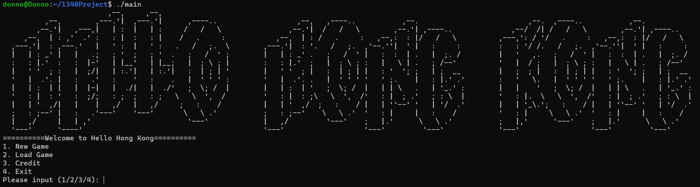

<a name="readme-top"></a>


[![Contributors][contributors-shield]][contributors-url]
[![Forks][forks-shield]][forks-url]
[![Stargazers][stars-shield]][stars-url]
[![Issues][issues-shield]][issues-url]


<!-- PROJECT LOGO -->
<br />
<div align="center">

  <h7 align="center">Hello Hong Kong</h7>

  <p align="center">
    A local RPG game that is full of memes!
    <br />
    <a href="https://github.com/MartinYu0510/Engg1340_Project"><strong>Explore the docs »</strong></a>
    <br />
    <br />
    <a href="https://github.com/MartinYu0510/Engg1340_Project/issues">Report Bug</a>
    ·
    <a href="https://github.com/MartinYu0510/Engg1340_Project/issues">Request Feature</a>
  </p>
</div>


<!-- TABLE OF CONTENTS -->
<details>
  <summary><font size = 5>Table of Contents</font></summary>
  <ol>
  <li><a href="#about-the-game">About The Game</a></li>
    <li>
      <a href="#about-the-project">About The Code</a>
      <ul>
        <li><a href="#built-with">Built With</a></li>
      </ul>
    </li>
    <li>
      <a href="#getting-started">Getting Started</a>
      <ul>
        <li><a href="#prerequisites">Prerequisites</a></li>
        <ul>
        <li><a href="#windows">Windows</a></li>
        <li><a href="#linux">Linux</a></li>
        <li><a href="#macOS">macOS</a></li>
      </ul>
        <li><a href="#installation">Installation</a></li>
      </ul>
    </li>
    <li><a href="#roadmap">Roadmap</a></li>
    <li><a href="#contributing">Contributing</a></li>
    <li><a href="#contact">Contact</a></li>
    <li><font size = 5 face = "Helvetica"><strong><a href="#members">Our Team Members</a></font></strong></li>
  </ol>
</details>

<!-- ABOUT THE PROJECT -->
## About The Game

### In this game, You will:

<a href="https://www.youtube.com/watch?v=dQw4w9WgXcQ"></a>

(c) GOVHK


<<<<<<< HEAD
=======
### OUR TEAM

[Full name][UID][GIT name]
- MA TIN YU 3036064416 MartinYu0510

- WONG KWUN YAT 3036065915 BORISWKT

- CHIK WAI CHING 3036068436 KC0072015
>>>>>>> 145463ad86467c041c105998699bd67a718efcac

### THE STORY LINE

For Hongkongers who have been working unhappily and want to let off steam about their work or life, this is the perfect RPG game that is designed for you. 
The story of this RPG game is basically talking about a random Hongkonger who wakes up late for his work and starts his day rushing to his company in a bad mood. 

He meets different things that most Hongkongers hate the most about their work, and he must beat them up to go back to his company. 

- It might be the morning alarm wakes you up every day.

- It might be a crazy passerby who keeps complaining you block their way to the company. 

- It might be an annoying colleague who always sarcasms you first and never keep their mouth shut. 

- Or it might be an arrogant and bossy boss who always complains about your work and performance but seldom or even never compliment others. 

You probably have met one of these things that make you unhappy, 
and we hope to provide you with a platform or a satisfying game for you to let off steam about your work.

Life still go one and we should not put our energy on something or someone who make us unhappy.

If you are having a bad day or want to express your anger,
we are always here to welcome you!
We also hope that you can forgive you enermy after defeating them,
to share the value of tolarence

<Strong><font face="Helvetica" size = "6" color = "RED"> P.S. We do NOT promote using violence to solve any problems.</font></Strong>

### Game Rules

- This is a RPG game, player will first enter thier name which create a character.
- Then the player will be asked which command will he/she want to input
- <strong>This is a singleplayer PVE game, for those who have friends, go make the multiplayer feature (or PVP)!</strong>

</img>

After input a integer(1/2/3/4), the game will produce related function.
There are in total 4 bosses, player has to beat them up so that we can move on to go back to the company.

If the player loss in the battle, the game will ended.
else, the player will be asked if he/she are willing to forgive the boss/enermy.
If the player choose "forgive", it will be consider as getting 1 point on good ending, 
and if the player gets 4 points on good ending, they can achieve "GOOD END" at the end.
<br>
<br>
<br>

<!-- ABOUT THE CODE -->
## About The Code

Our code meets all the requirements stated in the Project Requirements pdf. Here are the explainations.

### Generation of random game sets or events

- Under function `random_event` in `game_status.cpp`, we used `rand()` function to generate random events, such as critical hit and boss's moves.

### Data structures for storing status
- In `game_status.h`, we use a data structure called `Role` to store entities' dynamic informations:
  - Name
  - Skill
  - HP
  - Attack
  - SP
  - etc.
- Using unified data structures, we can reuse every functions to read / edit entities' dynamic informations.

### Dynamic memory management

- Under `save` function in `saveload.cpp`, we used pointers to temporarily store a structure Role of the player. After the data is saved into `saveload.txt`, the pointer is deleted, thus saving memory

### File IO
- In `saveload.cpp`, both functions uses the library `fstream`, which is used to
  - Save game into `saveload.txt` in `save()` function
  - Load game from `saveload.txt` in `load()` function

### Program codes in multiple files
- The whole game is separated into
  - `ascii.cpp` to store ASCII arts
  - `game_content.cpp` to store battle system
  - `game_plot.cpp` to store the plot of the story
  - `game_status.cpp` to store the battle system ui and plot
  - `saveload.cpp` to store fileIO functions
  - `start_menu.cpp` to store the start menu and ending
  - `main.cpp` to organise all the cpp


### Proper indentation and naming styles
- We used K&R style indentation:
  - ```
    function(){
      Expression
    }
    ```
- We used Snakecase naming styles:
  - ```
    player_loss
    ```
### In-code documentation
- We added comentries on functions for users understand the use of them.


### Built With

- 100% [![CPP][CPP.com]][cpp-url]
- 200% Love
- 300% Stress

<p align="right">(<a href="#readme-top">back to top</a>)</p>


<!-- GETTING STARTED -->
## Getting Started

Although this project will be marked using Ubuntu server in HKU, you can still use it in any system

### Prerequisites

<!-- WINDOWS -->
#### Windows
A compiler is required to compiler the cpp files. Here we will recommend users to setup with MingW. Here is the modified guide, originally written by [Microsoft Inc.](https://code.visualstudio.com/docs/cpp/config-mingw).

1.  Get the latest version of Mingw-w64 via  [MSYS2](https://www.msys2.org/), which provides up-to-date native builds of GCC, Mingw-w64, and other helpful C++ tools and libraries. You can download the latest installer from the MSYS2 page or use this  [link to the installer](https://github.com/msys2/msys2-installer/releases/download/2022-06-03/msys2-x86_64-20220603.exe).
2. Follow the  **Installation**  instructions on the  [MSYS2 website](https://www.msys2.org/)  to install Mingw-w64. Take care to run each required Start menu and  `pacman`  command.
3. Install the Mingw-w64 toolchain (`pacman -S --needed base-devel mingw-w64-x86_64-toolchain`). Run the  `pacman`  command in a MSYS2 terminal. Accept the default to install all the members in the  `toolchain`  group.
4. install make
	```pwsh
	winget install GnuWin32.Make
	```
5. Add the path to your Mingw-w64  `bin`  folder and the path to  your GnuWin32 file to the Windows  `PATH`  environment variable by using the following steps:

	1.  In the Windows search bar, type 'settings' to open your Windows Settings.
	2.  Search for  **Edit environment variables for your account**.
	3.  Choose the  `Path`  variable in your  **User variables**  and then select  **Edit**.
	4.  Select  **New**  and add the Mingw-w64 destination folder path to the system path. The exact path depends on which version of Mingw-w64 you have installed and where you installed it. If you used the settings above to install Mingw-w64, then add this to the path:  `C:\msys64\mingw64\bin`; If you used the settings above to install GnuWin32.Make, then add this to the path: `C:\Program Files (x86)\GnuWin32\bin`
	5.  Select  **OK**  to save the updated PATH. You will need to reopen any console windows for the new PATH location to be available.
6. install make
	```pwsh
	winget install GnuWin32.Make
	```

<!-- LINUX -->
#### Linux
Linux systems are easier to setup the g++ environment.
1. Install g++ and makefile in terminal
	```sudo apt install build-essential```
2. Install make to rune makefile
	```sudo apt install make```
2. Press enter for any asked questions.
3. Done!

<!-- MACOS -->
#### MacOS
~~As a typical engineer, I don't use MacBooks. So, we will NOT provide any support here.~~
<sub><sup>Use Windows, OK?😉</sup></sub>

### Installation

1. Clone the repo, by downloading the zip file of repository. For users using command prompt / terminal:
   ```sh
   git clone https://github.com/MartinYu0510/Engg1340_Project.git
   ```
2. In the destination file, compile the code using makefile
    ```sh
    make main
    ```
    Or
    ```sh
    make
    ```
3. run the game `main`
   ```sh
   ./main
   ```

<p align="right">(<a href="#readme-top">back to top</a>)</p>


<!-- ROADMAP -->
## Roadmap

- [ ] Add Changelog
- [ ] Better CLI Ux
- [ ] Add More ASCII arts
- [ ] Multi-language Support
    - [ ] Trad. Chinese
    - [ ] Cantonese
- [ ] GUI

See the [open issues](https://github.com/MartinYu0510/Engg1340_Project/issues) for a full list of proposed features (and known issues).

<p align="right">(<a href="#readme-top">back to top</a>)</p>


<!-- CONTRIBUTING -->
## Contributing

Contributions are what make the open source community such an amazing place to learn, inspire, and create. Any contributions you make are **greatly appreciated**.

If you have a suggestion that would make this better, please fork the repo and create a pull request. You can also simply open an issue with the tag "IMPROVEMENT".
Don't forget to give the project a star! Thanks again!

1. Fork the Project
2. Create your Feature Branch (`git checkout -b feature/IMPROVEMENT`)
3. Commit your Changes (`git commit -m 'Add some IMPROVEMENT'`)
4. Push to the Branch (`git push origin feature/IMPROVEMENT`)
5. Open a Pull Request

<p align="right">(<a href="#readme-top">back to top</a>)</p>


<!-- CONTACT -->
## Contact

Mail:[kc0072015@connect.hku.hk](mailto://kc072015@connect.hku.hk)

Project Link: [https://github.com/MartinYu0510/Engg1340_Project](https://github.com/MartinYu0510/Engg1340_Project)

<p align="right">(<a href="#readme-top">back to top</a>)</p>

<!-- MEMBERS -->
## Members

|<h2>Username</h2>|<center><h2>MartinYu0510</h2></center>  | <h2><center>KC0072015</center></h2>     | <h2><center>BORISWKT</center></h2>      |
| ------------- | ------------- | ------------- | ------------- |
|<H2>Handsome Image</h2>|<center></center>|<center></center>|<center></center>|
|<h2>UID</h2>| <center>3036064416</center>    | <center>3036068436</center>    | <center> 3036065915</center>   |
|<h2>Name</h2>|<center> Ma Tin Yu</center>     | <center>Chik Wai Ching</center>|<center> Wong Kwun Yat</center> |

<p align="right">(<a href="#readme-top">back to top</a>)</p>


<!-- MARKDOWN LINKS & IMAGES -->
[contributors-shield]: https://img.shields.io/github/contributors/MartinYu0510/Engg1340_Project?style=for-the-badge
[contributors-url]: https://github.com/MartinYu0510/Engg1340_Project/graphs/contributors
[forks-shield]: https://img.shields.io/github/forks/MartinYu0510/Engg1340_Project?style=for-the-badge
[forks-url]: https://github.com/MartinYu0510/Engg1340_Project/network/members
[stars-shield]: https://img.shields.io/github/stars/MartinYu0510/Engg1340_Project?style=for-the-badge
[stars-url]: https://github.com/MartinYu0510/Engg1340_Project/stargazers
[issues-shield]: https://img.shields.io/github/issues/MartinYu0510/Engg1340_Project?style=for-the-badge
[issues-url]: https://github.com/MartinYu0510/Engg1340_Project/issues
[product-screenshot]: img/New_Facilities.gif
[CPP.com]: https://img.shields.io/badge/-c++-black?logo=c%2B%2B&style=for-the-badge
[cpp-url]: https://isocpp.org/
